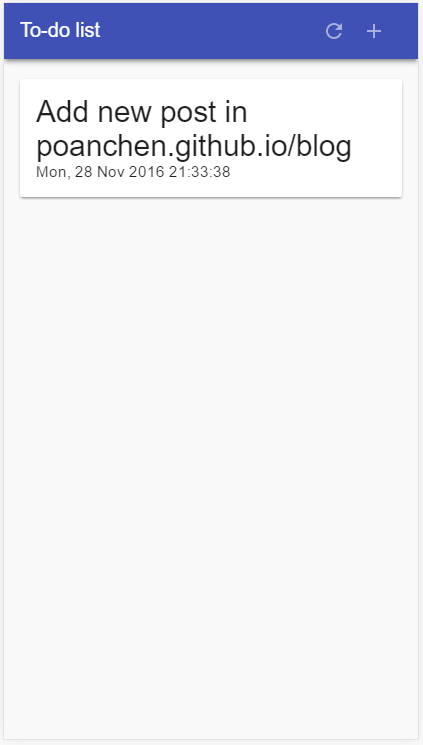

# pwa-to-do-list v1.0.5
A Progressive Web App - To-do list.  
Try it here: https://poanchen.github.io/pwa-to-do-list

## Technologies Used
- [JavaScript](https://www.javascript.com/)
- [Onsen UI 2](https://onsen.io/)
- [IndexedDB](https://www.w3.org/TR/IndexedDB/)
- [LocalStorage](https://www.w3.org/TR/webstorage/#the-localstorage-attribute) (If IndexedDB is not available)
- [Service Workers](https://developers.google.com/web/fundamentals/getting-started/primers/service-workers) (If the browser supports it)

## Screenshots

## Disclaimer
Some of the code was derived and inspired from [your-first-pwapp](https://github.com/googlecodelabs/your-first-pwapp) by [Google Codelabs](https://github.com/googlecodelabs), [OnsenUI-Todo-App](https://github.com/frankdiox/OnsenUI-Todo-App) by [frankdiox](https://github.com/frankdiox), and [to-do-notifications](https://github.com/mdn/to-do-notifications/) by [mdn](https://github.com/mdn).
